# Design Decisions
+ used links to html pages that resembled buttons to make transitioning
between pages easier.
+ used white, grey, and black for a minimalistic look
+ used san serif font for buttons and serif for other text
+ mark an item as completed by selecting the checkbox next
+ show all items at all times
  + don't let editing create a dialog box and hides other items

# Alternative Designs
+ no alternative designs

# User Testing
+ tested by Kip, going through tasks sequentially

# Final Design

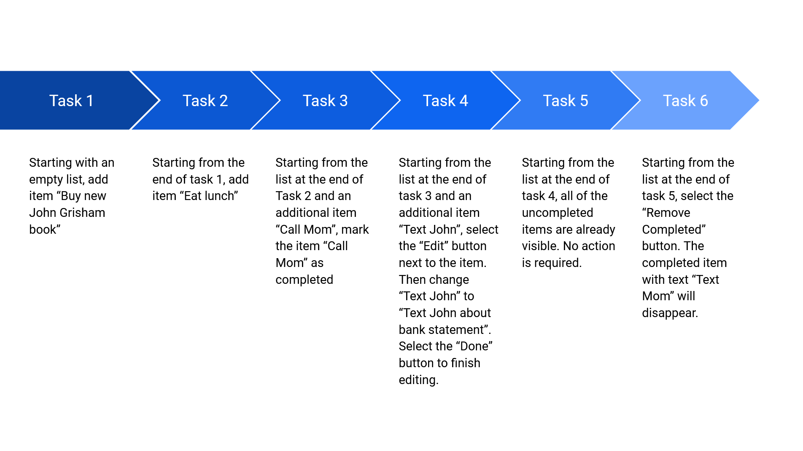

1. task 1: add item "Buy new John Grisham book"
+ To add item "Buy new John Grisham book", type in the desired task name in the text box next to "Add Item",
then select the Add Item button. After the Add Item button is pressed, the list will update to show the item.

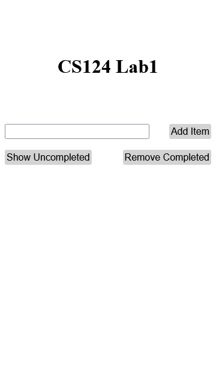
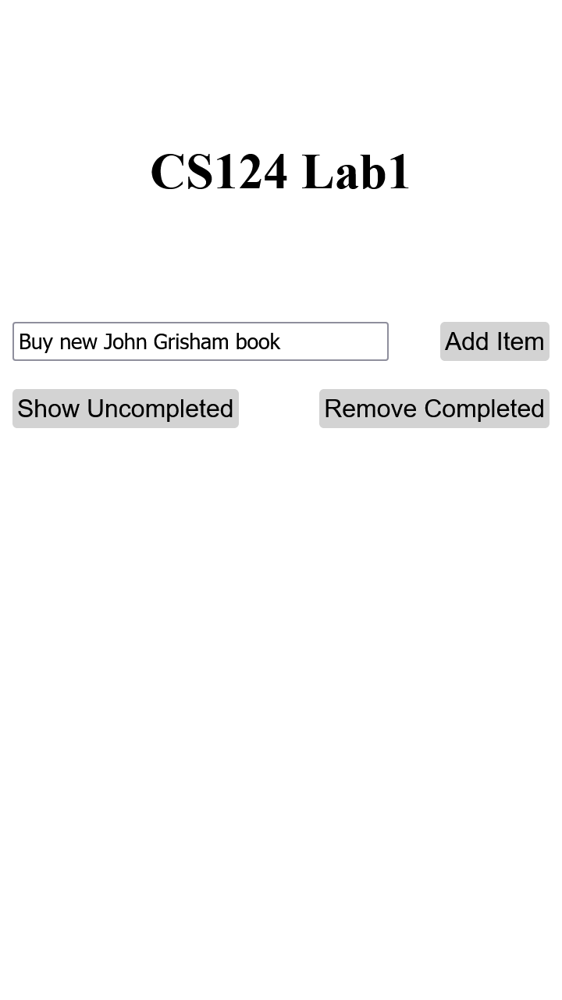
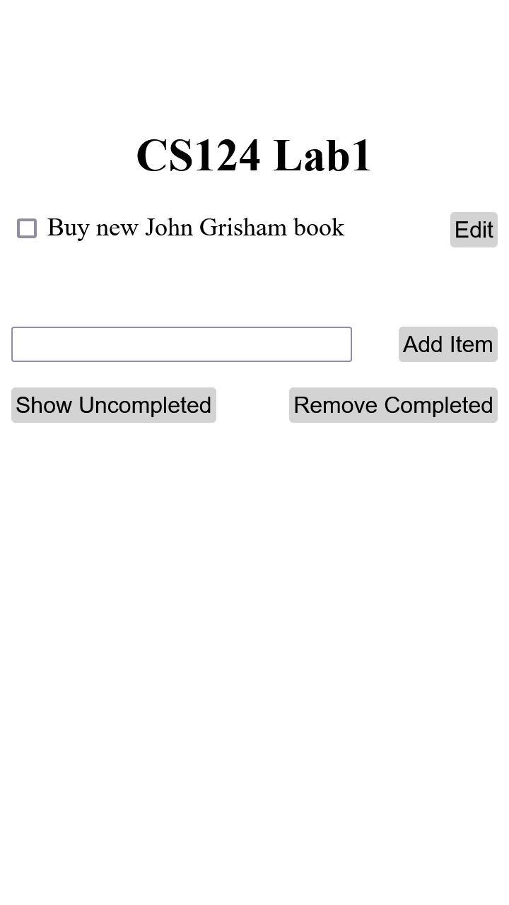

2. task 2: add item "Eat lunch"
+ To add item "Eat lunch", type in the desired task name in the text box next to "Add Item",
then select the Add Item button. After the Add Item button is pressed, the list will update to show the item.

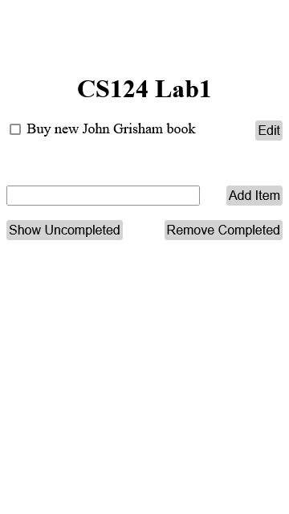
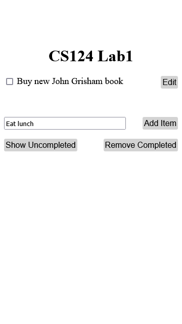
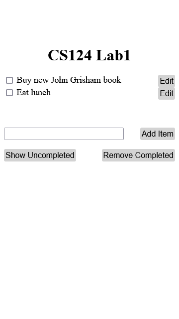

3. task 3: mark item "Call Mom" completed
+ To mark item "Call Mom" complete, select the check box left of the item. The list will update to show the item with grey text and strikethrough.

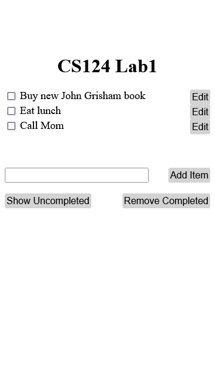
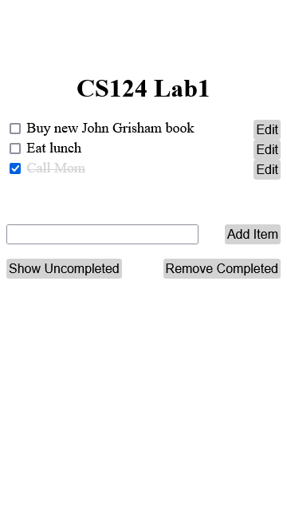

4. task 4: edit item "Text John" to "Text John about bank statements"
+ To edit item "Text John" select the "Edit" button right of the item to change the item format 
to a text box, which can then be edited to the desired item name. Then, select "Done" button to confirm the new item name or select "Done" with the original name if the change is no longer desired. The list will update to show the edited item.

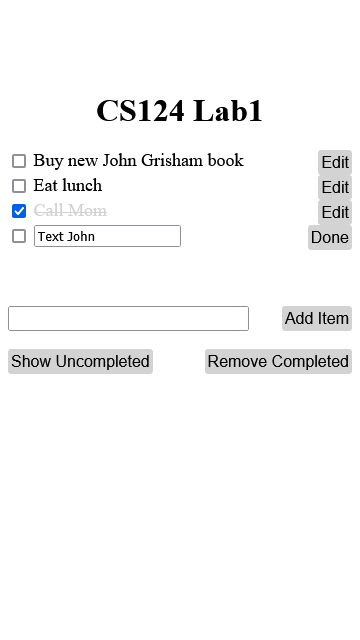
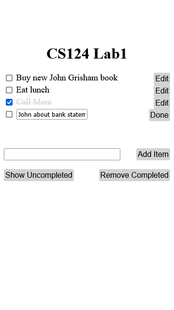
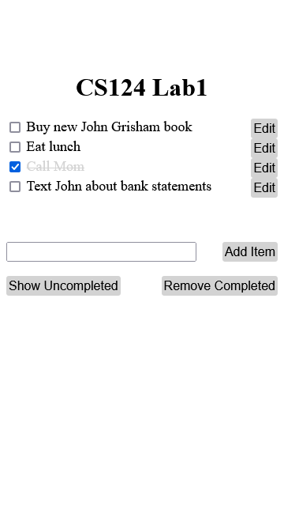

5. task 5: show only uncompleted tasks
+ Select the "Show Uncompleted" button while one or more items are marked as complete to temporarily remove those items from the list. The list will update to only display uncompleted tasks. Select "Show All Tasks" button to revert to the original list, showing both completed and uncompleted tasks.

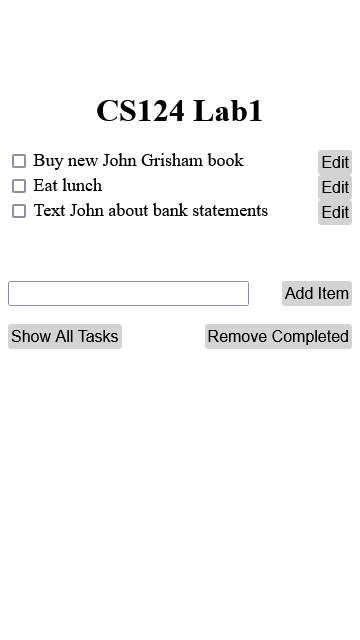

6. task 6: delete completed tasks
+ Select the "Remove Completed" button while one or more items are marked as complete to permanently remove those items from the list. The List will update to contain only the uncompleted items.

# Challenges
+ not understanding the specifications - how the tasks related to each other
  + attended office hours and received clarification about assignment
  + determined that task is to create a series of html pages that show
the specified tasks being executed
+ Chrome mobile view displays elements with abnormally small size, but
other browsers are unaffected

# Design Highlights
+ disguising links as buttons that link to the next page
+ allowed users to complete the tasks successfully and continuously,
without going back to index

# Timeline
+ 9 Sept
  + tried using a form with checkboxes and text inputs as labels
  + tried changing label color on checking box to resemble deletion
  + added button for creating new items (non-functional)
  + added css to modify text size and font

+ 13 Sept
  + attended office hours for clarification

+ 16 Sept
  + created html pages with lists and links to transition between them
decided order of tasks
  + used flexbox and gridbox to align elements
  + tested tasks and wrote design.md
