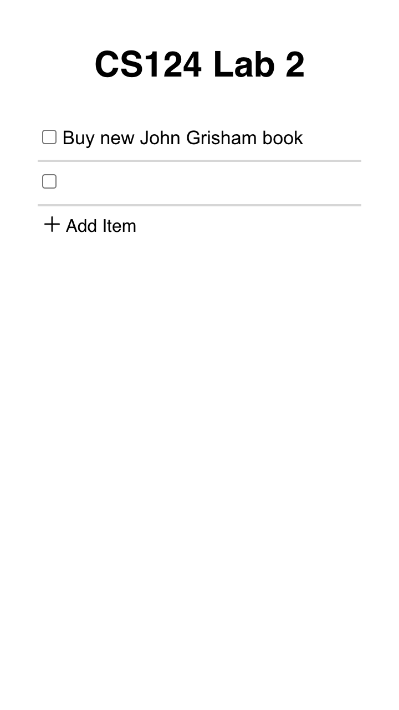
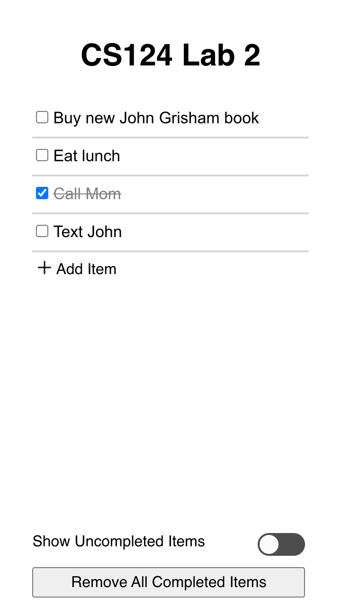
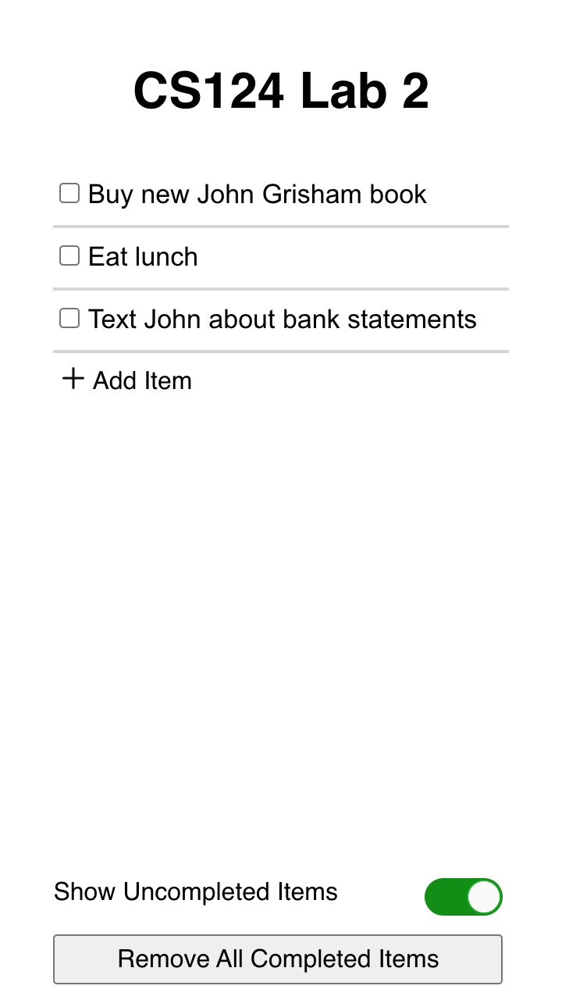
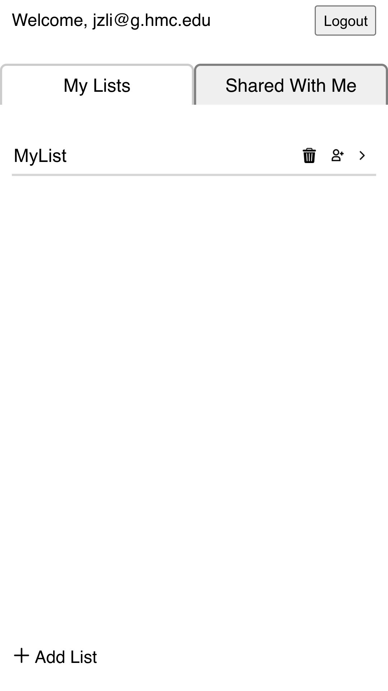

# Design Decisions
+ allowed users to click task text to begin editing task,
modeled after Google Keep app
+ clicking the "Add Item" button adds a new item and
focuses on it, allowing users to edit the item immediately,
modeled after Google Keep
+ used white, grey, and black for a simpler look, except
the confirm button for the "Remove All Completed Items"
alert popup, which is red for better visibility
+ used san serif font for all text
+ mark an item as completed by selecting the checkbox
next to it
+ show all items by default
+ users can toggle the "Hide Completed Tasks" slider to
hide all completed tasks, then toggle again to show all tasks
+ aligned the "Add Item" button with the tasks
+ positioned the "Hide Completed Tasks" and
"Delete Completed Tasks" buttons at the bottom of the
app, to show the difference between them and the other
items
+ added an alert popup when the user selects "Delete
Completed Tasks" to warn user that deletion is irreversible
+ displays the "Hide Completed Tasks" and "Delete
Completed Tasks" options only when there are completed
items, avoiding clutter
+ use select buttons for priority selection, does not allow
users to manually input priority level
+ use select button for sort selection, with options to
choose between date created, task name, or priority level,
does not allow users to manually input sort criteria
+ added "My Lists" and "Shared With Me" tabs to the top
of the list menu, in anticipation of Lab 5. The
"Shared With Me" tab currently only contains "Lists
Shared With Me" text, while the "My Lists" tab contains
a list menu
+ the list menu displays lists in rows, with each row
displaying the list name, a trash can icon, and a
next arrow icon
+ list names can be edited from the list menu and
lists can be deleted from the list menu, but in order
to make any changes to the tasks users must first
select the editing option from the list menu
+ added an alert popup when the user selects the trash
can icon on a list to warn user that deletion
is irreversible
+ clicking the "Add List" button adds a new list and
focuses on it, allowing users to edit the list immediately,
similar to the design for adding tasks
+ changed "Hide Completed Tasks" toggle label to
"Hide Completed Tasks" according to Lab 3 pull request
feedback
+ when alert is showing, made all other items unselectable
+ list owners have read and write permission, shared 
users have read only permission
+ the Sign In and Sign Up options are on the same 
page, with a Sign In With Google option included

# Alternative Designs
+ no alternative designs

# User Testing
+ tested by Alicia Lu, tested tasks sequentially
with the tasks read out to user, encountered no
problems or obstacles
+ tested by Jennifer and Kip, going through tasks
sequentially
+ also asked completed user tests in the final week of
iteration with Vivian Pou and Mandy Wu
  + both users thought that the general interface was
  very straightforward to use, and neither had any
  difficulty in completing the specified sequence of
  tasks
  + they did feel that the general aesthetic of the
  checkboxes, buttons, and toggle didn't match each
  other, so in the next lab, we should spend some time
  making them more visually similar.
  + these users both encountered difficulty with
  clicking on the checkbox when testing on the iPad,
  sometimes getting no result or accidentally clicking
  on the text (thus bringing up the keyboard). We
  rectified this situation by wrapping the check input
  with a div that is slightly larger than the bounds of
  the check input and having the div trigger an onClick
  that also changes the state of the checkbox.

# Accessibility Testing
[Keyboard and Screen Reader Demo]()

# Final Design

1. task 1: add item "Buy new John Grisham book"
+ To add item "Buy new John Grisham book", press the
"Add Item" button, then type in the desired task name
in the created text box

2. task 2: add item "Eat lunch"
+ To add item "Eat lunch", press the "Add Item" button,
then type in the desired task name in the created text
box

3. task 3: mark item "Call Mom" completed
+ To mark item "Call Mom" complete, select the checkbox
left of the item. The list will update to show the item with grey text and strikethrough.

4. task 4: edit item "Text John" to "Text John about
bank statements"
+ To edit item "Text John" select the text to begin
editing. After typing in the desired task name, press
Enter or otherwise deselect the item to confirm the
changes. To revert any changes, select the item again
and change the task to the original name.

5. task 5: show only uncompleted tasks
+ Toggle the "Hide Completed Tasks" slider at the
bottom left of the app, which appears when one or more
items are marked as complete, to temporarily remove those
items from the list. The list will update to only
display uncompleted tasks. Toggle the slider
again to revert to the original list, showing both
completed and uncompleted tasks.

6. task 6: delete completed tasks
+ Select the "Remove Completed Tasks" button, which
appears when one or more items are marked as complete,
and select "Confirm" on the alert popup to permanently
remove those items from the list. The
list will update to contain only the uncompleted items.
This change is irreversible.

# Changes from Lab 3 to Lab 4
+ added a menu of lists, displaying the lists in
rows with each row containing the list name and buttons
for delete list and edit list
+ added tabs to separate owned lists and shared lists,
though the shared lists tab is currently empty
+ the add list option adds a new list and automatically
focuses on the list name for instant editing

+ added support for screen readers
  + [here's a video of us using the app using screen reader and keyboard!](https://drive.google.com/file/d/1lLwrDAKPjqcnc77CesWMCUt-4OK8q5TO/view?usp=sharing)

# Challenges
+ implementing editing items on selection and
updating the displayed text as the edits happen
+ for some reason we were not able to make this happen
when the task ids were strings (for example 'task-2')
but we got it to work with integer ids.
+ automatically focusing the newest item after adding
new items
+ we learned that setState is an async function and
does not immediately update the state. We ended up
using `useEffect` to get the desired component to
focus on render
+ using a `useState` to change the menu or list
displayed

# Design Highlights
+ editing items on task selection rather than using a button
to begin the editing process
  + specifically, you can just click on the task's text
  to edit it
+ showing the "Hide Completed Tasks" and "Delete
Completed Tasks" options only when there are completed
tasks
+ used a toggle for "Hide Completed Tasks" since that made
it clearer that it was a binary state being toggled.
+ sticky header and footer
