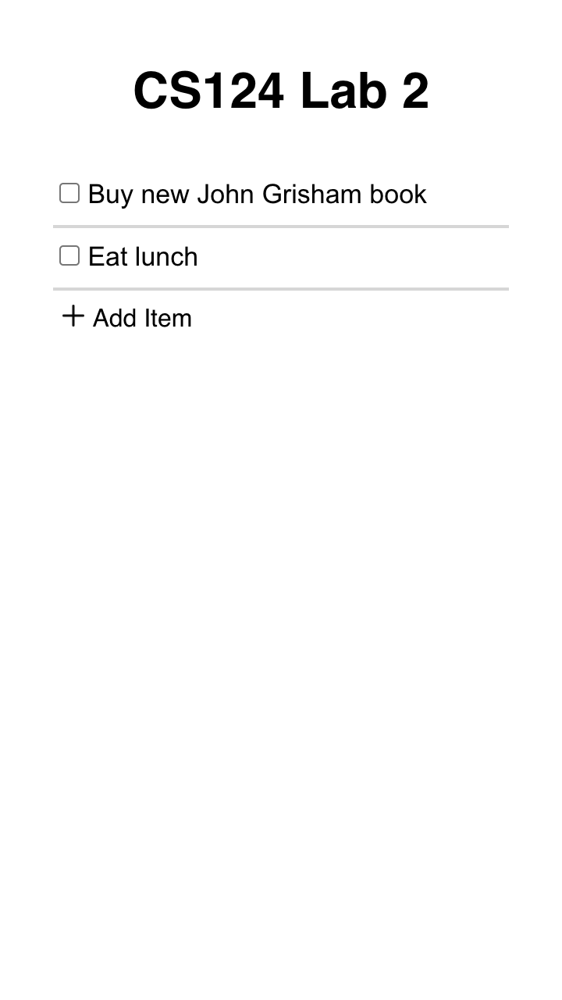
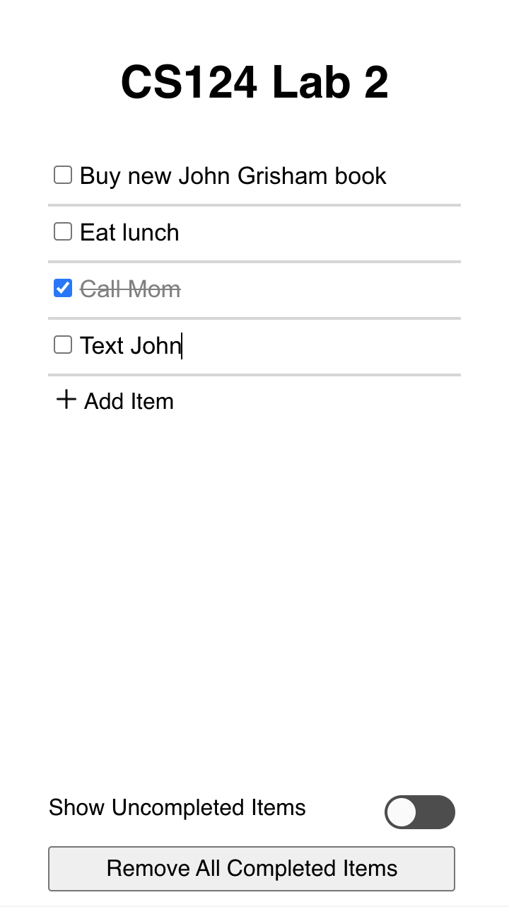

# Design Decisions
+ allowed users to click task text to begin editing task, 
modeled after Google Keep app
+ clicking the "Add Item" button adds a new item and 
focuses on it, allowing users to edit the item immediately,
modeled after Google Keep
+ used white, grey, and black for a simpler look, except
the confirm button for the "Remove All Completed Items"
alert popup, which is red for better visibility
+ used san serif font for all text
+ mark an item as completed by selecting the checkbox 
next to it
+ show all items by default
    + users can select the "Show Uncompleted Tasks" to 
  hide all completed tasks, then deselect to show all tasks
+ aligned the "Add Item" button with the tasks
+ positioned the "Show Uncompleted Tasks" and 
"Delete Completed Tasks" buttons at the bottom of the 
app, to show the difference between them and the other 
items
+ displays the "Show Uncompleted Tasks" and "Delete 
Completed Tasks" buttons only when there are completed 
items, avoiding clutter and useless buttons

# Alternative Designs
+ no alternative designs

# User Testing
+ tested by Jennifer and Kip, going through tasks 
sequentially

# Final Design

1. task 1: add item "Buy new John Grisham book"
+ To add item "Buy new John Grisham book", press the 
"Add Item" button, then type in the desired task name 
in the created text box

2. task 2: add item "Eat lunch"
+ To add item "Eat lunch", press the "Add Item" button, 
then type in the desired task name in the created text 
box

3. task 3: mark item "Call Mom" completed
+ To mark item "Call Mom" complete, select the checkbox 
left of the item. The list will update to show the item with grey text and strikethrough.

4. task 4: edit item "Text John" to "Text John about 
bank statements"
+ To edit item "Text John" select the text to begin
editing. After typing in the desired task name, press 
Enter or otherwise deselect the item to confirm the 
changes. To revert any changes, select the item again 
and change the task to the original name.

5. task 5: show only uncompleted tasks
+ Select the "Show Uncompleted Tasks" button at the 
bottom left of the app, which appears when one or more 
items are marked as complete, to temporarily remove those 
items from the list. The list will update to only 
display uncompleted tasks. Deselect "Show All Tasks" 
button to revert to the original list, showing both 
completed and uncompleted tasks.

6. task 6: delete completed tasks
+ Select the "Remove Completed Tasks" button, which 
appears when one or more items are marked as complete, 
to permanently remove those items from the list. The 
list will update to contain only the uncompleted items.
This change is irreversible.

# Challenges
+ implementing editing items on selection and 
updating the displayed text as the edits happen
+ automatically focusing the newest item after adding 
new items

# Design Highlights
+ editing items on selection rather than using a button 
to begin the editing process
+ showing the "Show Uncompleted Tasks" and "Delete 
Completed Tasks" options only when there are completed
tasks
