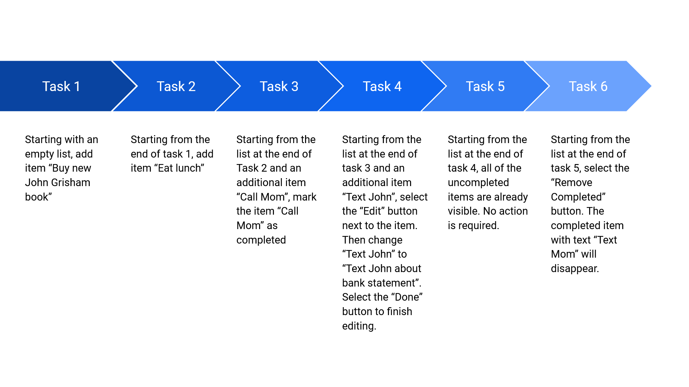

# Design Decisions
+ used flexbox for list items for better and easier
alignment and gridbox for list buttons to align with list items
+ used links to html pages that resembled buttons to make transitioning
between pages easier.
+ used white, grey, and black for a minimalistic look
+ used san serif font for buttons and serif for other text

# Alternative Designs
+ no alternative designs

# User Testing
+ tested by Kip, going through tasks sequentially

# Final Design
1. task 1: add item "Buy new John Grisham book"
2. task 2: add item "Eat lunch"
3. task 3: add item "Call Mom" and mark item "Call Mom" completed
4. task 4: add item "Text John" and edit to "Text John about bank statements"
5. task 5: show uncompleted tasks
6. task 6: delete completed tasks
7. index: contains list of tasks and links to respective pages

# Challenges
+ not understanding the specifications - how the tasks related to each other
  + attended office hours and received clarification about assignment
  + determined that task is to create a series of html pages that show
the specified tasks being executed

# Design Highlights
+ disguising links as buttons that link to the next page
+ allowed users to complete the tasks successfully and continuously,
without going back to index

# Timeline
+ 9 Sept
  + tried using a form with checkboxes and text inputs as labels
  + tried changing label color on checking box to resemble deletion
  + added button for creating new items (non-functional)
  + added css to modify text size and font

+ 13 Sept
  + attended office hours for clarification

+ 16 Sept
  + created html pages with lists and links to transition between them
decided order of tasks
  + used flexbox and gridbox to align elements
  + tested tasks and wrote design.md
